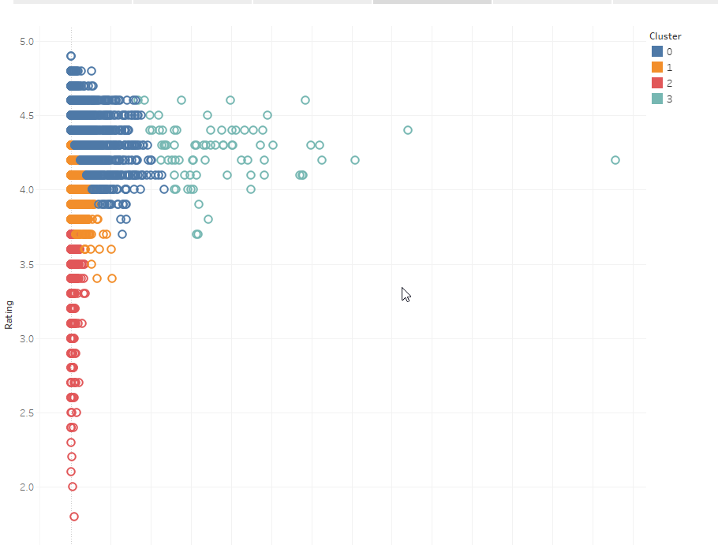
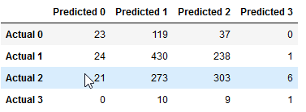
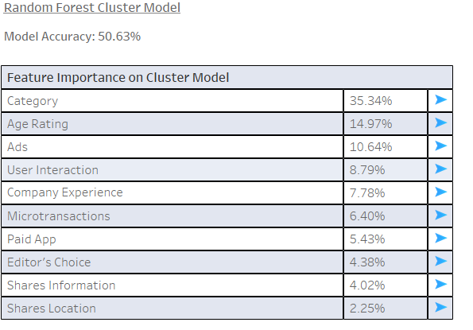

# Game App Analysis

## Presentation

Selected topic:

Our group decided to look at phone app data, targeting specifically on games and figuring out what makes a game app successful.

Reason for selected the topic:

The reason we chose this topic is because we were interested to utilize the things we learned into real life application and were generally interested in what makes games a success in the mobile industry.

Description of the source of data:

Our data is from Kaggle, where the source was obtained through scraping of millions of Android smartphone logs & app metadata.

Source data: https://www.kaggle.com/kboghe/android-apps-metadata; https://www.kaggle.com/gauthamp10/google-playstore-apps

By joining the two datasets together, we are able to separate variables into outcomes & features that will be used for further analysis (as well as other variables we will use to control the outcome variables' flaws).

Questions hope to be answered with the data:

Through this project, we are hoping to find out what makes a game app successful using the data available to us. We will first determine/define a measure of success i.e. installs/downloads and rating, where one provides a quantitative measure and the latter provides a qualitative measure. Afterwards, we will use our metric of success to find out which features are likely to influence whether a game app is successful or not using machine learning to assist with our analysis.

Description of data exploration phase of the project:

To better understand our dataset, our initial step was to plot the various variables against each other to discover any potential relationships among the variables using Tableau. Unfortunately due to the nature of the dataset, it was difficult to find any obvious relationships other than plotting the two outcome variables against each other, where it showed a diminishing returns type plot; the theory here is that low ratings is associated with low downloads i.e. game is poor therefore performance is also poor, up until a certain threshold where ratings do not relate as strongly with downloads. Further analysis is done via machine learning to assist with better analysis.

Description of analysis phase of project:

Our initial analysis was to find out our shape of data including finding their respective distributions/quartiles and to scope out if there were any obvious trends (there weren't anything popping out of the page). Most of our initial analysis was done via graphing and can be seen in our Tableau dashboard (see link further below).

Technologies Used:

-Python
	-Sklearn
	-Plotly
	-Pandas
	-Numpy
	-Date Time
	-Pyodbc
-Microsoft SQL
-Tableau

Google slides link: https://docs.google.com/presentation/d/1YsTrKkXzDnzWGElksHiISTcvOJJ-okg0IZHveucjpxA/edit?usp=sharing

## Machine Learning Model

Description of preliminary data processing:

-Removed unnecessary columns within our dataset e.g. duplicated columns, rating distribution that didn't make sense,
certain pricing features, currency, app size, etc.
-Removed null and/or errors for rows of data
-Cleaned the number reviews column, where certain values were in string format e.g 5.5k, and changed them to numerical values
-Filtered out rows with less than 1,000 reviews (around the first quartile cut-off) to mitigate ratings weakness as a metric i.e. not enough reviews to make it a 'true' reflection of user experience
-Combined two kaggle datasets together based on their app name so that we obtain more features e.g. number of installs, dates, etc.
-Created another table where we grouped developers to determine whether a company is experienced & the number of game apps under the developer

Description of preliminary feature engineeering and preliminary feature selection including their decision making process:

Our first step was to create a success metric based on downloads and ratings. The current download values is flawed as it has not been controlled for time i.e. we expect apps released earlier to have higher number; to account for this, we came up with a relative metric where each app's download is divided by the average downloads for a given year based on when the app was released. Ratings as previously discussed was controlled by filtering out those apps that do not meet the threshold requirements of reviews. With these two metrics, our first action was to standardize the figures and use PCA to amalgamate the two metrics into a single variable that we use as our success metric. We then use clustering algorithim to assign clustering labels onto our dataset.

As for our features, we take all features given in our clean dataset except for those previously removed in preprocessing stage. The other features were removed due to either of the following: there were duplicated values within the dataset, other columns better reflected the feature itself, extremely skewed results i.e. only one outcome, or likely were not relevant to our analysis e.g. company website.

Description of how data was split into training and test sets:

Once clustering was complete, we used unsupervised learning for further analysis as clustering showed distinct clusters of varying success per graph below.

Next we perform a logistic regression using the clusters as our outcome variable on our features. We split the data into 75/25 between training and testing in preparation of our model. No additional training was done to our model.

Explanation of changes:

Since segment 2, we made a minor change in our encoding strategy, where we used get dummies instead of the encoder so that we obtain a breakdown of genre and age rating impact individually on the model. As a result of the change, the model accuracy remained about the same but the impact of genre has been reduced in the model.

Explanation of model choice, including limitations and benefits:

We chose random forest as our logistic regression model due to its reliable performance, ability to process complex multiple outcomes i.e. SVM can only process binary outcomes and explanatory power i.e. neural network suffers from poor explanatory of results. Unfortunately the model suffers from potential lack of data for extreme outcomes i.e. clusters 0 & 3, and we may need to perform oversampling techniques to potentially mitigate these effects.

Description and explanation of model's confusion matrix, including final accuracy score:

From the confusion matrix seen below, we see that our model is much better at predicting clusters 1 & 2, while performing poorly for clusters 0 & 3. We also notice that errors in prediction are usually within 1 cluster of each other. 

Our combined model accuracy is 50.6% and the results are seen below. From the importance ranking, we see that genre & age ranking are our most important indicators of influencing which cluster a given game app will belong to. 

## Dashboard

We will be using Tableau to display our story/dashboard in the following link: https://public.tableau.com/profile/calvin3235#!/vizhome/dashboards_16178363779870/CategoryDashboard?publish=yes

Our interactive feature allows users to drill down into specific variables for deeper analysis.

